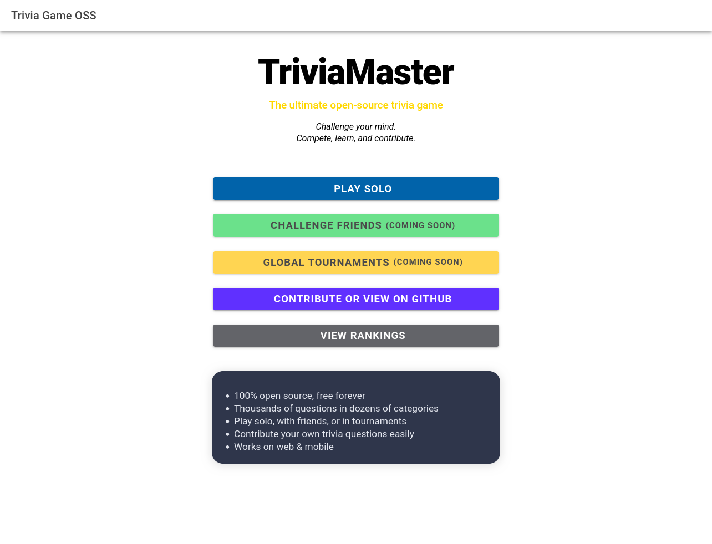
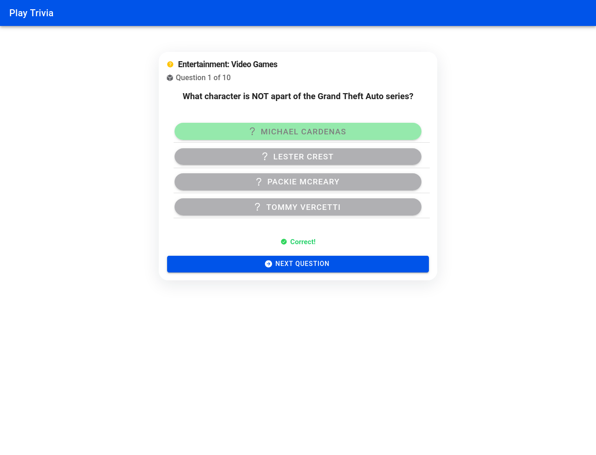
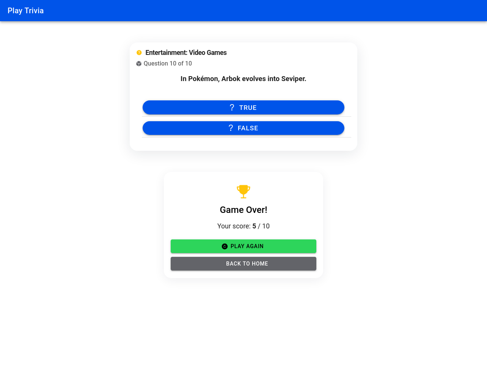
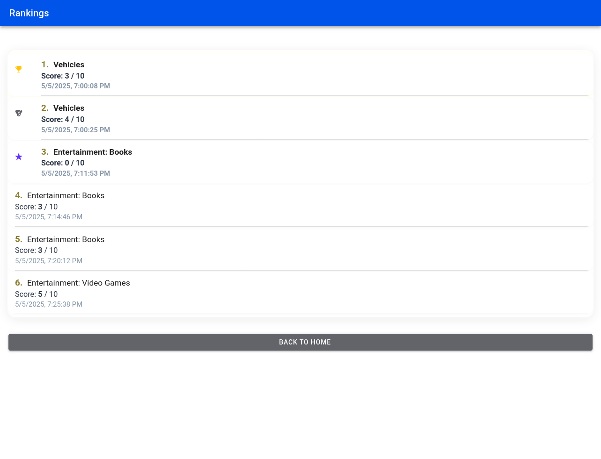

# TriviaMaster Frontend

> A modern, open-source trivia game built with Angular & Ionic.

## Overview
TriviaMaster is a responsive and visually polished trivia game. Challenge yourself with thousands of questions, track your rankings, and enjoy a seamless experience across devices.

## Features
- **Modern UI**: Sleek, animated, and mobile-friendly interface
- **Solo Play**: Answer trivia questions across multiple categories
- **Category Selection**: Choose from a wide range of trivia topics
- **Rankings**: View your best scores and compete with yourself
- **Feedback & Animations**: Instant feedback, icons, and smooth transitions
- **Open Source**: Easily extend and contribute

## Screenshots

### Main Menu

### Category Selection

### Game Flow

### End Game / Results

### Rankings

## Getting Started
1. Clone the repo
2. Install dependencies: `npm install`
3. Run the app: `npm start`

## Contributing
Pull requests are welcome! For major changes, please open an issue first to discuss what you would like to change.

## License
[MIT](LICENSE)
